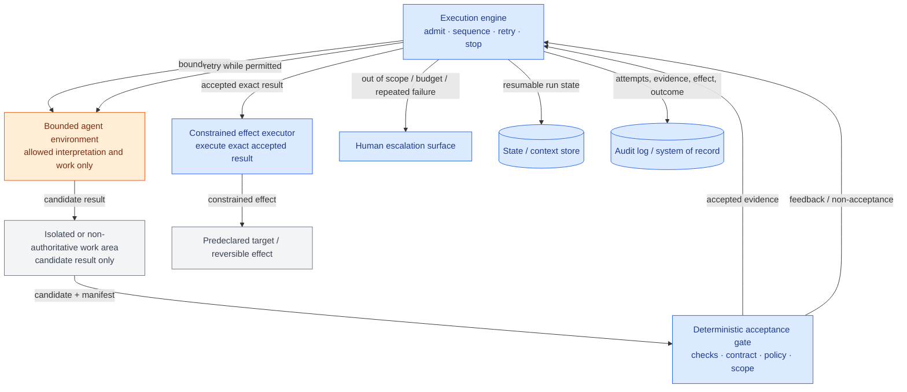
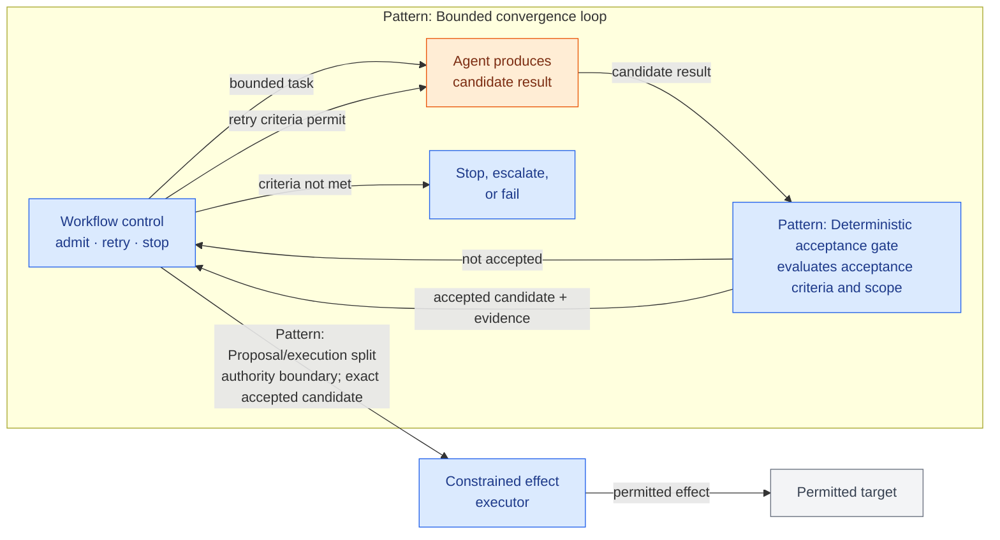
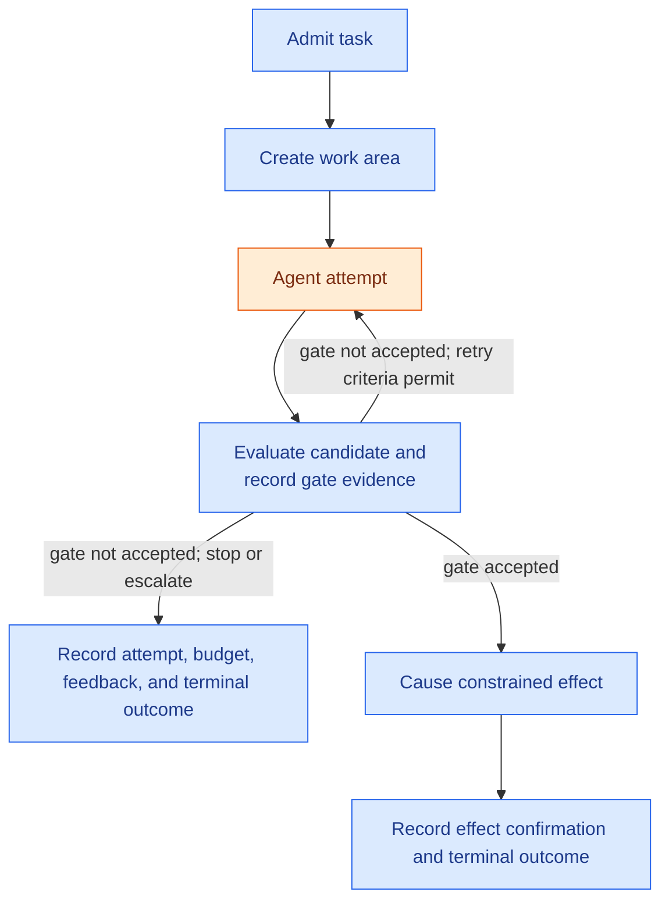

# Bounded Autonomous Remediation

**The job it serves:** Resolving one bounded problem autonomously, using independent acceptance evidence and safe escalation when the work does not converge \
**Built from patterns:** [Bounded convergence loop](../patterns/bounded-convergence-loop.md) · [Deterministic acceptance gate](../patterns/deterministic-acceptance-gate.md) · [Proposal/execution split](../patterns/proposal-execution-split.md) \
**Requires capabilities:** Execution engine · bounded agent/tool environment · isolated or non-authoritative work area · deterministic gate · state/context store · constrained effect executor · audit log · escalation surface \
**Audience:** Engineers building bounded autonomous workflows · architects reviewing autonomy boundaries · operational owners accountable for the work queue

## Status

Draft for working group review. Nothing here is locked. This architecture is proposed as a contrasting companion to the [human-approved operation](single-agent-human-approval.md): it permits bounded autonomous iteration where independent acceptance evidence exists, but it does not permit unbounded autonomy or uncontrolled effects.

## Purpose

This architecture serves a recurring practitioner job: resolve one small, bounded problem without requiring a human approval for every attempt, while preserving clear limits on what the agent may do and clear evidence for why the result was accepted.

Use it when the task has a declared scope, allowed tools, budget, and independently checkable acceptance condition; the permitted effect is constrained and reversible or otherwise low enough impact for policy-authorized execution. Examples can include opening a remediation pull request, creating a corrected draft record, preparing a change request, or producing a reconciled correction batch.

Do not use it for open-ended objectives, work whose result needs human judgment to accept, or effects whose impact requires a named human authorization.

This architecture guarantees:

- **Bounded autonomy.** The agent has only the task scope, tools, data, credentials, and budget declared for one run.
- **Independent acceptance.** A deterministic gate, not the agent, decides whether a candidate result meets the declared acceptance condition.
- **Controlled effect.** Only the exact accepted, scope-valid result may reach the predeclared external effect; the agent cannot invoke a stronger capability.
- **Safe non-convergence.** Exhausted budget, repeated failure, ambiguous evidence, or out-of-scope work ends in an explicit recorded outcome and can escalate to a human-owned process.

**Reading paths:** Read *Is this your architecture?*, *Structure*, and *Pattern composition* to decide whether this job fits. Read *Exit states* and *Composition considerations* when reviewing or implementing it. The autonomous maintenance run in the appendix is an illustrative validation scenario, not the definition of this architecture.

## Is this your architecture? (checklist)

1. **Is the problem explicitly bounded before work starts?** The run needs a known task contract, allowed scope, permitted tools/data, and measurable acceptance condition. If the objective is open-ended or changes during execution, this is not the architecture.
2. **Can an independent deterministic gate evaluate the result?** Tests, reconciliation rules, contracts, schemas, or policy rules must provide evidence meaningful enough for the effect that follows. If only human judgment can decide acceptability, route to the human-approved operation architecture.
3. **Is the permitted effect constrained?** The effect must be predeclared and limited to the accepted result. A reversible effect is the normal fit. High-impact, irreversible, or broadly scoped effects need a different architecture with stronger authorization.
4. **Can the agent be fenced?** The agent needs an isolated or non-authoritative work area and only the tools, credentials, data, time, and budget necessary for this task. If it needs broad standing access, this is not bounded autonomy.
5. **Is there a safe non-success route?** Repeated failure, exhausted budget, invalid scope, missing gate evidence, or an ambiguous effect result must route to a recorded stop, reconciliation, or human-owned follow-up.

If every answer is yes, this architecture fits. If the answer to questions 2 or 3 is no because a person must decide, use the [human-approved operation](single-agent-human-approval.md). If the answer to question 1 or 4 is no, do not force open-ended autonomous work into this architecture; it requires a different job-oriented architecture. If the answer to question 5 is no, do not run the task autonomously until a recorded stop, reconciliation, or human-owned follow-up path is defined.

The same checklist works in reverse for an existing workflow: every “no” is an identified gap before treating it as bounded autonomy.

## Variants

No variants are currently defined. The following nearby flows are deliberately not variants:

- **[Human-approved operation](single-agent-human-approval.md)** uses a named human decision before a protected effect. It has a different attribution and authority model.
- **Policy-authorized remediation with stronger effects** may retain an independent gate but needs an architecture that defines policy authority, reconciliation, and stronger effect controls.
- **Open-ended agent work** has no stable enough scope or stopping condition for this bounded convergence loop.
- **Fleet-wide remediation** fans out across many targets and needs additional composition for target discovery, admission control, batching, and aggregation. This architecture can govern each individual target run but does not define the fleet-wide parent workflow.

## Structure

Component-and-relationship level only. The agent’s internal reasoning loop is deliberately unspecified: deterministic, ReAct-style, or other bounded internals are equal implementation choices inside the agent boundary.

> **Diagram legend:** Orange = agent-driven or probabilistic work. Blue = workflow-controlled capabilities and decisions. Gray = external targets or neutral work areas.

| Capability | Responsibility in this architecture | Charter basis |
|---|---|---|
| Execution engine / orchestrator | Admits one task; owns sequencing, budgets, retries, stop conditions, effect routing, and escalation | 3A, 3B |
| Bounded agent environment | Interprets the task and creates candidate results using only allowed tools and data | 3A, 3C |
| Isolated or non-authoritative work area | Keeps candidate work separate from protected or authoritative state until acceptance | 3C |
| Deterministic acceptance gate | Independently evaluates the exact candidate against declared checks, contract, policy, and scope | 3A, 3F |
| State / context store | Persists task scope, attempts, budgets, candidate identity, and gate evidence across restart or wait | 3B |
| Constrained effect executor | Performs only the predeclared effect for the exact accepted candidate; reconciles uncertain results before retry | 3A, 3F |
| Human escalation surface | Delivers a bounded handoff with task, candidate, evidence, and reason to a human-owned process | 3D |
| Audit log / system of record | Records run identity, attempts, acceptance evidence, effect, and terminal outcome | 3B |

These are logical capability roles, not a prescribed deployment topology. A platform may implement several roles together, but the authority boundaries and guarantees must remain enforceable.

## Pattern composition

The patterns have different roles in this architecture:

- The **bounded convergence loop** controls task admission, repeated attempts, and retry or stop decisions.
- The **deterministic acceptance gate** is used inside that loop to evaluate every candidate result.
- The **proposal/execution split** is an authority boundary: the agent may produce a candidate result as its proposal, but only workflow control may pass the accepted candidate to the constrained executor.

Read the diagram from left to right:

1. The **bounded convergence loop** uses workflow control to admit the task, record each attempt, and retry or stop according to configured criteria.
2. The **deterministic acceptance gate** evaluates every candidate result in that loop. A non-accepted result returns to workflow control; an accepted result leaves the loop with recorded evidence.
3. The **proposal/execution split** prevents the agent from causing the external effect. Workflow control passes only the exact accepted candidate to the constrained executor.

| Pattern | Relationship in this architecture | Where it sits | Why it is required here |
|---|---|---|---|
| [Bounded convergence loop](../patterns/bounded-convergence-loop.md) | Controls task admission, repeated attempts, and retry or stop decisions | From task admission through repeated candidate attempts | Gives iteration a finite scope, budget, and safe non-convergence outcomes |
| [Deterministic acceptance gate](../patterns/deterministic-acceptance-gate.md) | Used by the convergence loop to evaluate every candidate result | After every candidate result | Provides independent, recorded evidence that a result meets declared acceptance and scope conditions |
| [Proposal/execution split](../patterns/proposal-execution-split.md) | Separates the agent's proposal from the external effect; workflow control passes only an accepted candidate to the executor | Between accepted candidate and external effect | Prevents the agent from directly invoking a stronger capability or changing the exact accepted result |

**Invalid composition:** giving the agent a credential or tool path that can cause an effect outside the declared scope, or allowing it to execute an effect without the deterministic acceptance evidence. That is not a leaner variant; it removes the independent acceptance and constrained-effect guarantees that define this architecture.

## The agent and workflow-control boundary

The agent may:

- inspect the bounded task and permitted context;
- use the allowed diagnostic, analysis, or editing tools inside the non-authoritative work area;
- produce a candidate result and associated explanation or manifest;
- receive deterministic gate feedback and make another permitted attempt.

The agent must not:

- expand task scope, tool/data access, credentials, budget, or acceptance criteria;
- decide that its own result has passed the gate;
- alter the accepted candidate after evidence is recorded;
- invoke the constrained executor or a stronger external capability directly;
- reset its own iteration, time, or cost budget.

Workflow-controlled activities admit the task, establish the work area, preserve state, evaluate the gate, enforce scope/budget, invoke the constrained effect executor, reconcile uncertain effects, and record escalation or completion.

## Choosing deterministic and model-driven activities

Use deterministic workflow control for admission, duplicate detection, scope enforcement, work-area creation, budget tracking, acceptance checks, policy validation, effect execution/reconciliation, and terminal-state recording.

Use model reasoning only where explicit rules are not enough: interpreting an unfamiliar problem, selecting an allowed repair or correction, or producing a candidate artifact. The agent does not own acceptance, authority, effects, or termination.

## Exit states

Every run ends in one of the following recorded outcomes:

| Exit state | Reached when | Recorded as |
|---|---|---|
| Completed | The exact accepted candidate caused the declared constrained effect successfully | Task, candidate digest, acceptance evidence, effect confirmation |
| Rejected | Admission rules reject the task or scope before work begins | Admission decision and reason |
| Escalated | The task becomes out of scope, repeatedly fails, needs human judgment, or has ambiguous acceptance evidence | Handoff package, last candidate, evidence, and reason |
| Budget exhausted | Iteration, time, or cost limit is reached before convergence | Consumed budget, attempt history, and last gate result |
| Failed | Work area, gate, state, or constrained execution fails beyond its recovery policy | Failure class, last durable state, and recovery evidence |
| Cancelled | An authorized requester or operator stops the run before the effect | Cancelling principal, reason, last candidate/state |

## Worked scenario

The following scenario illustrates the architecture; it does not limit the architecture to software maintenance.

### Autonomous maintenance run ("night shift")

A scheduled or triage-labelled task requests a small dependency bump, lint/type correction, or documentation repair.

1. **Admit the task.** The workflow checks duplicate work, declared repository/scope, allowed effect, and available budget. It rejects or escalates anything outside the contract.
2. **Create the work area.** The workflow creates a fresh isolated sandbox with scoped credentials. The agent cannot alter production, merge, or deploy.
3. **Produce a candidate.** The agent diagnoses the issue and makes an allowed candidate change in the sandbox.
4. **Evaluate independently.** Deterministic CI, contract checks, and scope validation evaluate the exact candidate. The evidence is recorded with the candidate identity.
5. **Converge or stop.** Failure returns feedback for another attempt only while configured retry criteria permit. Repeated failure, missing evidence, or out-of-scope work escalates or ends the run.
6. **Cause the constrained effect.** The executor opens one pull request for the exact accepted candidate. It records the effect and completes; merge and deployment remain separate decisions.

### The run over time — where bounded recovery lives

### If the process dies mid-run

| If the process dies during… | What happens on restart | What makes it safe |
|---|---|---|
| Admission / work-area creation | The workflow resumes or reconciles the declared task and work-area state | Task identity and admission state are recorded before work proceeds |
| Agent attempt | The workflow resumes from recorded loop state; it does not create a new attempt or reset the budget | Attempt number, budget, and candidate state are durable |
| Gate evaluation | The workflow reconciles the gate result or reruns the deterministic gate for the same candidate | Candidate identity and acceptance evidence are bound together |
| Constrained effect | The executor reconciles whether the exact effect already occurred before retrying | The effect is constrained and must be idempotent or reconciled |
| Escalation | The handoff remains discoverable and is not reissued without deduplication | Escalation identity and terminal/parked state are recorded |

## Composition considerations

- **Acceptance evidence has a limited claim.** A passing gate is evidence only for the acceptance contract it checks. If gate quality is weak, the permitted scope and effect must remain correspondingly narrow.
- **Scope must survive the loop.** Every retry uses the original task contract; gate feedback cannot silently expand the task, tools, or permitted effect.
- **The effect needs its own recovery rule.** A gate can prove a candidate is acceptable but cannot prove whether a network call to an external target succeeded. The executor must use idempotency or reconciliation before retrying an ambiguous effect.
- **Fan-out is not free.** Many independent target runs may each use this architecture, but the parent fan-out, batching, aggregation, and reviewer-capacity controls are a separate composition.
- **Untrusted input remains untrusted.** External task descriptions, diagnostics, or source material must not override the task contract, tool allowlist, or effect constraints.

## Out of scope (handled elsewhere)

- **Identity, credential issuance, and delegation enforcement** — Identity & Trust WG. This architecture requires scoped credentials and separation from stronger effect authority; it does not specify the identity mechanism.
- **Prompt injection, malicious content, and data-exfiltration controls** — Security WG. This architecture identifies untrusted task inputs but does not define the security controls.
- **Quality of tests, checks, and agent-produced results** — Reliability & Accuracy WG. The gate is only as meaningful as its declared contract and evaluation quality.
- **Tracing, metrics, and operational telemetry** — Observability WG. The audit/system-of-record requirement is execution evidence, not an observability specification.

## Validation record

| Scenario | Source | Result | Notes |
|---|---|---|---|
| Autonomous maintenance run ("night shift") | [Critical Use Cases inventory](../../critical-use-cases/use-case-inventory.md) | Candidate fit | Exercises bounded task scope, independent convergence gate, reversible pull-request effect, budget limit, and exception escalation. The source is a WG-contributed production scenario. |
| Closed-loop dependency & CVE remediation (fleet-wide) | [Critical Use Cases inventory](../../critical-use-cases/use-case-inventory.md) | Partial fit | Each repository may use this architecture as one bounded target run. Fleet-wide discovery, fan-out, batching, and closure aggregation require a future composition. |

## Open questions

- Should idempotent/reconciled external execution become a separate reusable pattern, or remain a mandatory capability/invariant of architectures with effects?
- Does an explicit fan-out/join pattern need to be added before documenting fleet-wide remediation as a complete architecture?
- What minimum evidence makes a deterministic gate strong enough for different classes of constrained effect?

## Appendix: additional examples of the same job

The architecture can apply outside software maintenance when the same guarantees hold:

| Candidate scenario | Bounded task | Independent gate | Constrained effect |
|---|---|---|---|
| Data-quality correction | Correct one identified record/batch anomaly | Reconciliation, schema, and policy checks | Create a correction batch or draft update |
| Configuration remediation | Correct one approved staging configuration drift | Desired-state and health checks | Create a change request or staged configuration update |
| Structured-document repair | Repair one incomplete structured submission | Schema, completeness, and business-rule checks | Save a corrected draft for later review/submission |

These are illustrations only. A scenario fits only if it satisfies the checklist and can preserve the stated guarantees.
