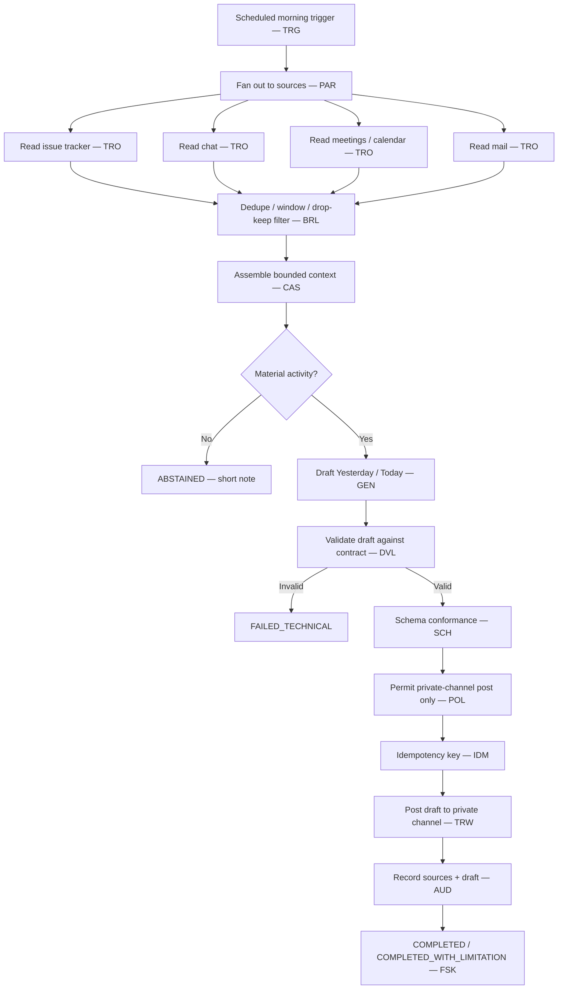

# Daily Activity Report — Solution

Status: Worked example

*This is the **Architecture + Result**: the design the [rationale](rationale.md) produced,
and the machine-readable WDS it maps to.*

## The design in one picture

Then, **outside the run boundary**, the owner reads the draft in the private channel, edits
it, and forwards it to managers by hand. That review is deliberately *not* a workflow step.

## Result — the WDS

The complete, schema-valid Workflow Design Specification is:

**[daily-activity-report.wera.yaml](daily-activity-report.wera.yaml)**

Key resolved values:

| Field | Value |
|---|---|
| `selected_profile` | `EP2` |
| `selected_pattern` | `WP01` |
| `embedded_patterns` | `WP00` |
| `lifecycle_envelope` | *(none)* |
| `overlays` | `OV-02` |
| `external_boundaries` | `XB-01`, `XB-02`, `XB-03`, `XB-05` |
| `readiness_tier` | `RT1` |
| `conformance_target` | `CL2` |

## How the effect is protected

Posting the draft is the one externally visible action — a reversible write (`EF2`), so it
follows the [`OV-02`](../../ra/06-overlays/workflow-overlays.md) separation of roles:

1. **propose** — deterministic controls assemble the exact message payload from the
   validated draft;
2. **validate** — `DVL` checks the draft against its contract (required sections, length
   bound, and that no harvested text is treated as an instruction);
3. **authorise** — `POL` permits posting **only** to the owner's private channel, nowhere
   else;
4. **execute** — the chat adapter posts with an idempotency key (`IDM`) and single-channel
   constrained credentials;
5. **confirm** — a postcondition check confirms exactly one message landed;
6. **reconcile** — an ambiguous post result is resolved against the channel rather than
   blind-retried (avoids [AP-05](../../ra/02-architecture-model/composition-rules.md)).

The generation model never calls the chat API directly
([INV-009](../../ra/01-foundations/architecture-invariants.md),
[INV-010](../../ra/01-foundations/architecture-invariants.md)).

## Why this passes conformance

- **`CL0`** — the descriptor is schema-valid.
- **`CL1`** — invariants and composition rules hold: deterministic baseline documented
  (`WP00`), the model output is a proposal validated before it becomes the message
  ([INV-009](../../ra/01-foundations/architecture-invariants.md)), the effect is protected
  and idempotent, untrusted input is contained
  ([INV-018](../../ra/01-foundations/architecture-invariants.md)), one system of record
  ([INV-002](../../ra/01-foundations/architecture-invariants.md)), a terminal outcome always
  reached ([INV-005](../../ra/01-foundations/architecture-invariants.md)), and the semantic
  step can abstain ([CR-019](../../ra/02-architecture-model/composition-rules.md)).
- **`CL2`** — the one triggered overlay (`OV-02`) is applied and every touched boundary
  (`XB-01`, `XB-02`, `XB-03`, `XB-05`) is declared, not redefined
  ([INV-015](../../ra/01-foundations/architecture-invariants.md)).

Readiness `RT1` (controlled pilot) matches an `IM1` impact: a weak draft is corrected before
it ever leaves the private channel.

## Detailed views

For depth, see [architecture](views/architecture.md), [execution](views/execution.md),
[sequence](views/sequence.md), and [contracts-and-state](views/contracts-and-state.md).