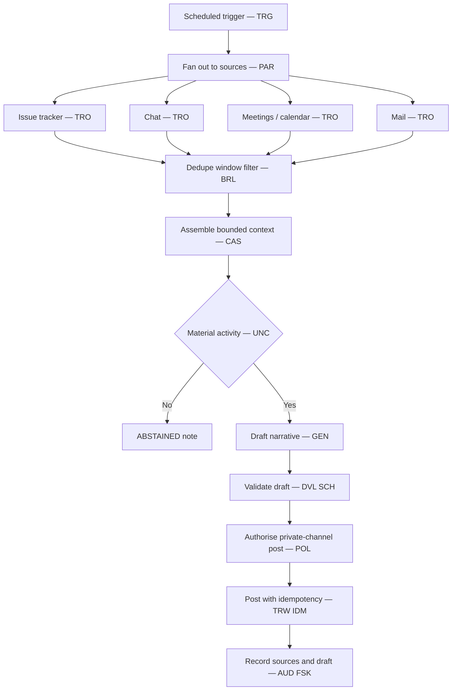

# Daily Activity Report — Architecture

Status: Worked example

*This is a **detailed view** of the [solution](../solution.md). It shows where this workflow
sits, what is in and out of scope, the logical pipeline, and who is responsible for what.*

## Architectural position

This workflow runs under profile `EP2` — workflow-directed and model-assisted. The workflow
runtime holds control-flow, decision, action-authorisation, execution, and state authority
throughout ([INV-006][architecture-invariants], [INV-007][architecture-invariants]). A model
is used in exactly **one** bounded step (`WP01`) and only ever **proposes**: it drafts the
"Yesterday / Today" narrative, which `DVL` validates before it becomes the posted message. No
model holds any of the five authorities, selects a source, chooses a branch or tool, or
performs the write.

The deterministic baseline `WP00` — read, dedupe, filter, format, post, record — carries
everything except the narrative itself. That keeps the design least-agentic
([DP-01](../../../ra/01-foundations/design-principles.md)) while closing the one genuine
semantic gap.

## Scope

**In scope**

- A scheduled working-day-morning trigger (`TRG`) that starts the run.
- Reading the owner's own activity across configured sources over a time window as read-only
  calls (`TRO`), fanned out in parallel with a join (`PAR`, `FS5`).
- Deterministic dedupe, time-windowing, and drop-list / keep-list filtering (`BRL`) and
  bounded context assembly (`CAS`) — the `WP00` baseline.
- Abstention (`UNC`) when there is no material activity, rather than a padded draft.
- One bounded generation step (`GEN`) that drafts the narrative, validated by `DVL` and
  `SCH` before use (`WP01`).
- Posting exactly one copy to the owner's private channel as a reversible write `TRW` at
  `EF2`, protected by the `OV-02` separation and made idempotent by `IDM`.
- A run audit record of which sources were read and which draft was posted (`AUD`).

**Out of scope**

- Sending the report to managers or anyone but the owner. The workflow stops at the private
  channel; forwarding is a manual, out-of-band human action.
- Any write to a source system (closing a ticket, replying to a message, editing a
  calendar). The harvest is strictly read-only.
- An in-run approval gate. Review is post-hoc, in the private channel, **after** the run
  ends — so no `WP07` / `OV-01`.
- Autonomous scheduling or any customer-visible action.

The private channel *is* the review surface, but that review happens **outside the run
boundary**. The workflow's job ends when the draft lands.

## Logical architecture

## Actor responsibilities

| Actor | Responsibility | Explicit limits |
|---|---|---|
| Workflow runtime | Holds control-flow, sequencing, and disposition; drives every transition; owns the run lifecycle. | Never delegates decision or state authority to the model; does not itself call the chat API. |
| Source adapters | Read the owner's activity from each source over the time window (`TRO`). | Read-only; least privilege; no write scope in any source system. |
| Deterministic baseline | Dedupe, time-window, drop-list / keep-list filter (`BRL`) and context assembly (`CAS`) — the `WP00` floor. | Applies rules only; does not invent activity; produces the bounded context the model sees. |
| Generation model | Proposes the "Yesterday / Today" narrative from assembled context via `GEN`; may abstain through `UNC`. | Output is untrusted until `DVL` validates it; holds no authority; never posts; never reads a source directly ([INV-009][architecture-invariants]). |
| Validation and policy | `DVL` + `SCH` validate the draft against its contract; `POL` permits posting only to the owner's private channel. | Rejects or routes rather than guessing; authorises one destination channel and nothing else; cannot be bypassed by the model. |
| Chat adapter | Executes the `TRW` post with an `IDM` key and single-channel constrained credentials; confirms one message landed. | Posts to the owner's private channel only; ambiguous results reconcile, never blind-retry ([INV-011][architecture-invariants]). |
| Workflow state store | Records run audit history (`AUD`) — sources read, draft posted. | Source systems remain authoritative for the activity itself ([INV-002][architecture-invariants]); not a shadow record of the owner's work (avoids `AP-07`). |
| Owner (out of band) | Reads the draft in the private channel, edits it, forwards it to managers by hand. | This review is **not** a workflow step; it happens after the run's terminal outcome. |

## Related views

- [execution.md](execution.md) — stage-by-stage walkthrough.
- [sequence.md](sequence.md) — interaction sequence.
- [contracts-and-state.md](contracts-and-state.md) — contracts and state checkpoints.

<!-- link definitions -->
[architecture-invariants]: ../../../ra/01-foundations/architecture-invariants.md