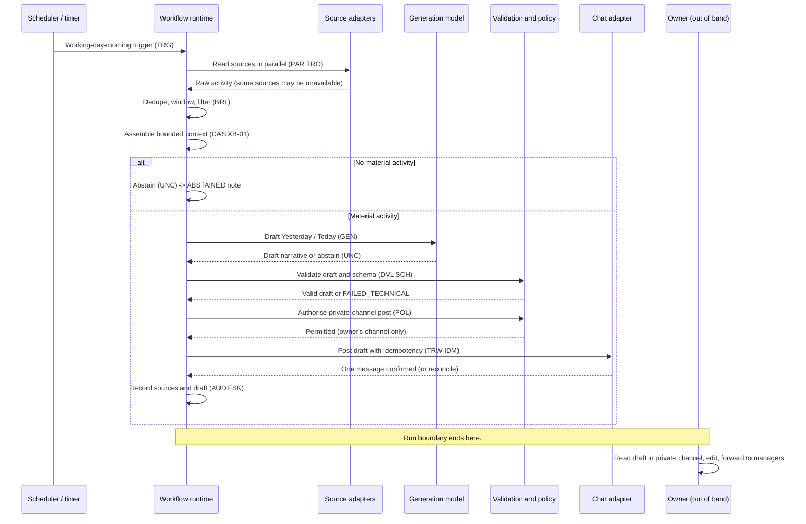

# Daily Activity Report — Sequence

Status: Worked example

*This is a **detailed view** of the [solution](../solution.md). It shows the interaction
sequence across participants, including the abstain and post branches.*

## Interaction sequence

## Important boundary

Two boundaries define this design.

**The model never posts.** The generation model returns its draft to the workflow runtime,
which validates it (`DVL`, `SCH`), authorises a single destination (`POL`), and only then
instructs the chat adapter to post it as a reversible `EF2` write with an idempotency key.
This preserves the `OV-02` propose→validate→authorise→execute→confirm→reconcile separation
and keeps all five authorities away from the model
([INV-009](../../../ra/01-foundations/architecture-invariants.md),
[INV-010](../../../ra/01-foundations/architecture-invariants.md)).

**The human review is outside the run.** The workflow's terminal outcome is *draft posted*.
The owner then reads, edits, and forwards it — but that happens **after** the run boundary,
in the private channel, with no workflow step waiting on it. That is exactly why this design
carries no in-run approval gate (`WP07` / `OV-01`) and no durable wait (`WP08` / `OV-04`):
the review is real, but it is out of band.

## Related views

- [architecture.md](architecture.md) — logical architecture and actors.
- [execution.md](execution.md) — stage-by-stage walkthrough.
- [contracts-and-state.md](contracts-and-state.md) — contracts and state checkpoints.