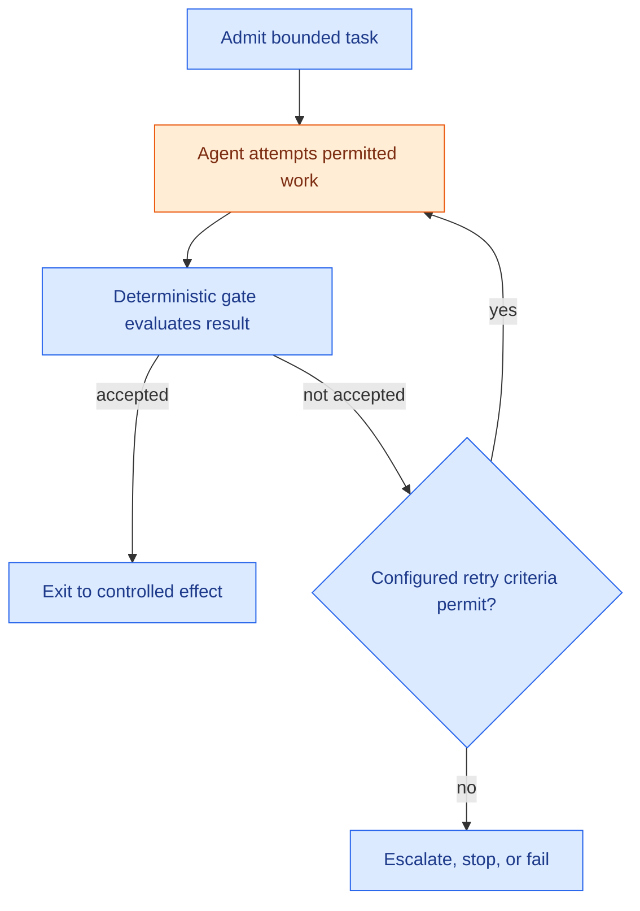

# Bounded Convergence Loop

**Solves:** Safely iterating an agent-assisted task until a deterministic acceptance condition passes, or ending in a defined non-success outcome \
**Used in:** [Bounded autonomous remediation](../architectures/bounded-autonomous-remediation.md) \
**Requires capabilities:** Workflow engine · bounded agent/tool environment · deterministic gate · state/context store · audit log \
**Related patterns:** [Deterministic acceptance gate](deterministic-acceptance-gate.md) · [Proposal/execution split](proposal-execution-split.md) · [Durable wait](durable-wait.md)

## Problem

Some bounded tasks cannot be completed in one attempt. An agent may need to diagnose a problem, make a change, run a check, read the result, and try again. Examples include a small dependency update, a lint/type correction, or a narrowly scoped documentation repair.

The workflow needs the benefit of iteration without granting an agent an open-ended objective, unlimited retries, or authority to declare its own result acceptable.

## Why this is hard

- An agent can keep trying without making progress, consuming cost and time.
- A model can judge its own result as good even when a deterministic check disagrees.
- A passing check can still be outside the task's declared scope.
- Re-running a loop after restart can repeat effects unless state and attempts are recorded.
- A loop that has no safe stopping condition turns an ordinary failure into unattended drift.

## Solution

> **Diagram legend:** Orange = agent-driven or probabilistic work. Blue = workflow-controlled capabilities and decisions.

The workflow admits one explicitly bounded task, gives the agent only the tools and scope needed for that task, and evaluates every attempt against a deterministic gate. The gate—not the agent—decides whether the loop has converged. A retry is allowed only while configured retry criteria permit, including scope and declared iteration, time, and cost limits.

## Invariants (must hold in any implementation)

- The task has an explicit scope, allowed capabilities, and acceptance condition before the loop begins.
- The agent cannot declare convergence; a deterministic gate evaluates every candidate result.
- Every retry has a declared budget: at least an iteration limit and one of time or cost limit.
- The workflow records attempt number, gate result, and the reason for each retry or terminal outcome.
- A failed gate result can lead only to a bounded retry, escalation, abstention, or recorded failure—not an unbounded loop.
- A result that passes the gate but violates scope cannot proceed to a protected effect.
- After a workflow restart, the loop resumes from recorded state; it does not create a new attempt, silently forget previous attempts, or reset the budget.

## Failure modes when violated

- No iteration or cost limit → the workflow consumes budget indefinitely without converging.
- Agent self-certifies success → a plausible but incorrect change proceeds without independent evidence.
- Gate ignores task scope → a technically passing change exceeds the authority granted to the run.
- Attempt state is not recorded → restart resets the loop and hides repeated failure.
- Failed gate always retries → an impossible task becomes an unattended incident instead of an escalation.

## Implementation approaches (illustrative, not requirements)

The key variation is where the workflow persists its loop state and how it obtains deterministic evidence. The same invariants apply whether the agent runs in a coding sandbox, a document-processing workflow, or another bounded environment.

| Loop environment | Documented mechanism | What it provides | What the implementation must add |
|---|---|---|---|
| CI-backed code task | [GitHub Actions workflow runs](https://docs.github.com/en/actions/managing-workflow-runs-and-deployments/managing-workflow-runs/viewing-workflow-run-history) | A recorded pass/fail result for configured checks | A task-scope contract, retry/cost limits, isolated execution, and a policy for failures that tests do not explain |
| Durable workflow runtime | [AWS Step Functions retry and catch](https://docs.aws.amazon.com/step-functions/latest/dg/concepts-error-handling.html) | Explicit retry and terminal error routing in workflow state | A deterministic acceptance gate, bounded agent tools, idempotent effects, and domain-level attempt evidence |
| Persistent agent graph | [LangGraph persistence](https://docs.langchain.com/oss/python/langgraph/persistence) | Saved execution state across activities and interrupts | Explicit iteration/cost limits, a gate independent of the agent, and safe routing on non-convergence |

## Known uses outside agents

Compiler/test-fix loops, optimisation algorithms with stopping criteria, and industrial control loops all iterate toward an independently measured condition. The agent-specific delta is that the proposed change is open-ended and probabilistic, so scope, tool access, budgets, and the independent gate must be explicit.
