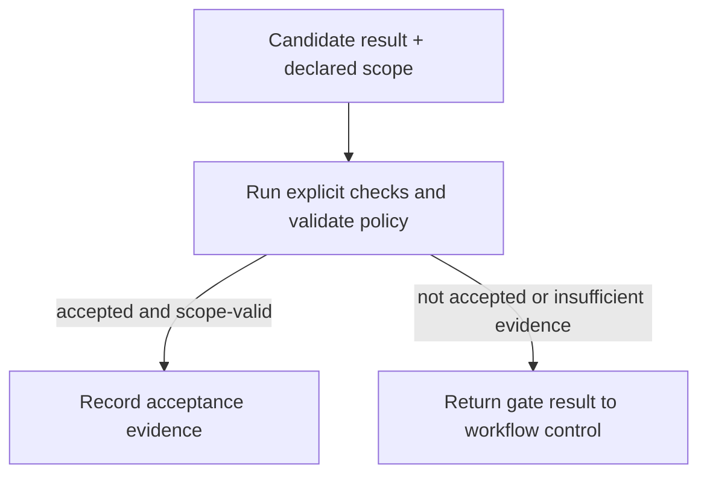

# Deterministic Acceptance Gate

**Solves:** Deciding whether a candidate result may advance using explicit, repeatable checks rather than model self-assessment \
**Used in:** [Bounded autonomous remediation](../architectures/bounded-autonomous-remediation.md) \
**Requires capabilities:** Deterministic evaluator · policy/scope validator · evidence store \
**Related patterns:** [Bounded convergence loop](bounded-convergence-loop.md) · [Proposal/execution split](proposal-execution-split.md)

## Problem

A workflow needs a trustworthy answer to: “Is this result acceptable enough to continue?” For a bounded task, letting the same model that produced a result answer that question makes the workflow vulnerable to confident but wrong self-assessment.

The workflow needs a gate based on explicit criteria: tests, contracts, schema checks, policy rules, or other repeatable evidence. A passed gate is evidence for the declared acceptance condition, not a general claim that the result is correct in every respect.

## Why this is hard

- A candidate result can pass a technical check yet remain incomplete or outside the declared scope; the gate must evaluate both acceptance criteria and scope.
- A check can be flaky, stale, or too weak for the decision it controls.
- A result can be accepted after its inputs or environment changed.
- Gate evidence can be lost or detached from the candidate result it evaluated.
- Teams can treat a green check as permission for a larger effect than the check was designed to justify.

## Solution

Evaluate the exact candidate result against declared, deterministic acceptance criteria and scope rules. Scope may limit the target (the system, record, repository, or resource affected), permitted change class (the kind of modification allowed), data accessed, allowed tools or actions, and permitted effect (the external outcome that may be applied). Record the evidence with the candidate identity. Only a result that both passes the checks and remains within the task's allowed scope may advance to the next workflow activity.

The enclosing workflow decides how to handle a non-accepted result—for example, retrying within configured criteria, stopping, escalating, or recording failure. The gate does not make that control-flow decision.

## Invariants (must hold in any implementation)

- Acceptance criteria are declared before the candidate result is evaluated.
- The gate is independent of the model or agent that produced the candidate result.
- Acceptance evidence is bound to the exact candidate version or digest evaluated.
- Passing the gate is insufficient if policy or scope validation fails.
- A failed, unavailable, or ambiguous gate result never counts as acceptance.
- The workflow records the check inputs, outcome, and decision made from that outcome.
- The gate's authority is limited to its declared contract; stronger effects need their own authorization controls.

## Failure modes when violated

- Agent evaluates its own work → unsupported confidence becomes workflow truth.
- Evidence is not tied to a candidate version → a different result can advance under stale evidence.
- Gate failure defaults to pass → unavailable verification becomes permission.
- Scope validation is omitted → a passing change exceeds the run's granted authority.
- Weak test suite treated as universal proof → a green result causes an unjustified effect.

## Implementation approaches (illustrative, not requirements)

The concrete gate varies by task, but its result must remain explicit, reproducible, and bound to the evaluated candidate.

| Gate type | Documented mechanism | What it provides | What the implementation must add |
|---|---|---|---|
| Software verification | [GitHub required status checks](https://docs.github.com/en/repositories/configuring-branches-and-merges-in-your-repository/managing-protected-branches/about-protected-branches#require-status-checks-before-merging) | Configured checks must pass before protected branch updates | A task-scope rule, evidence retention, and controls for actions outside the protected branch |
| Structured-data validation | [JSON Schema validation](https://json-schema.org/understanding-json-schema/) | Repeatable validation of an artifact against declared structure | Semantic/business-rule checks and policy determining what may happen after validation |
| Policy evaluation | [Open Policy Agent policy language](https://www.openpolicyagent.org/docs/latest/policy-language/) | Declarative rules evaluated against supplied input | Trusted input collection, policy versioning, and evidence that links the decision to the candidate result |

## Known uses outside agents

Continuous integration gates, database constraints, schema validation, and policy-as-code all prevent a result from advancing solely because its producer claims it is acceptable. The agent-specific delta is that model-generated candidates can be persuasive but uncertain, making independent, recorded acceptance evidence especially important.
